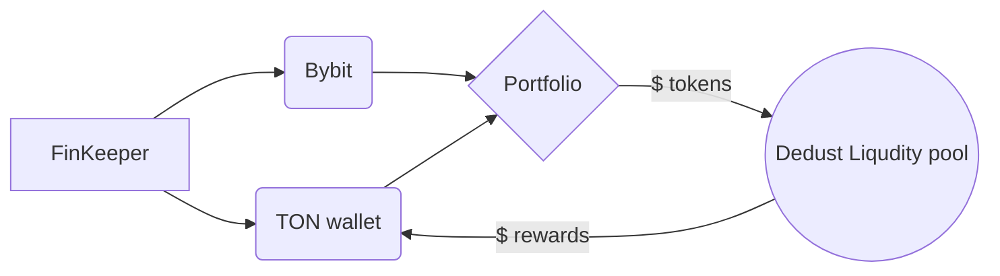
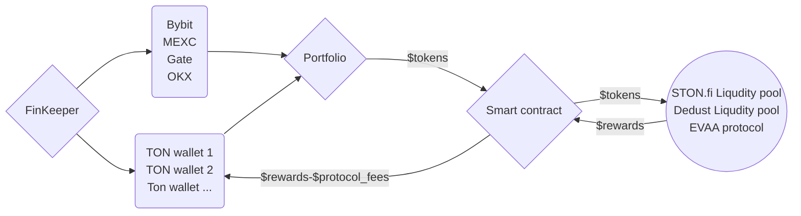
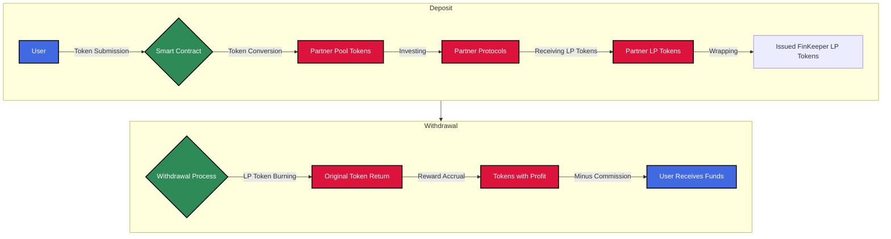

# Finkeeper
[FinKeeper](https://t.me/finkeeper\_app\_bot) is an assets tracking and yield farming Telegram mini-app.

FinKeeper is a Telegram mini app in that will show you a complete picture of your crypto assets in different networks, blockchains, from different wallets and exchanges.

It will also allow you to use the yield farming function on TON blockchain — get income on your assets in literally one click, choosing the best offer right inside your portfolio.

A useful bonus for all DeFi fans will be the APR calculator, which can quickly calculate the real benefit of any protocol for your investment amount.

### Integrations
   

# Links
## For developers
-   **[Telegram mini app itself](https://t.me/finkeeper_app_bot?start=7dccedf56cbec221467013d53b0aa373)**
- [Onchain API for DeDust integration](onchain)
- [Onchain analytics service for tracking assets and parsing APR from DeDust](onchain-analytics)
## For users
-   **[Telegram mini app itself](https://t.me/finkeeper_app_bot?start=7dccedf56cbec221467013d53b0aa373)**
-   [TG channel (EN)](https://t.me/+EcdwEgf0kjVmNjli)
-   [TG channel (RU)](https://t.me/+OvMVn3V9mDRjYzc6)
-   [User docs GitBook EN](https://finkeeper.gitbook.io/finkeeper/en)
-   [User docs GitBook RU](https://finkeeper.gitbook.io/finkeeper)
-   [X.com (Twitter)](https://x.com/FinKeeper/)
-   [YouTube overview RU](https://youtu.be/df085zBj6e0)
-   [YouTube video course RU](https://www.youtube.com/playlist?list=PLk_I_DvdiWKV7fCTwPQHFj1Z6cNmdWRH6)  

## How it works

Version 1 (november 2024):


Version 2 (january 2025):



# FinKeeper Smart Contract: Advanced DeFi Liquidity Management [work in progress]
FinKeeper is an innovative DeFi aggregation platform designed to simplify and optimize liquidity provision and yield farming across multiple blockchain networks and protocols. By smart contract automation, FinKeeper allows users to effortlessly participate in complex DeFi strategies with minimal effort and maximum efficiency.



<details><summary>See details about FinKeeper Smart Contract</summary>

## Technical Architecture
### Core Workflow
  
FinKeeper's core workflow is designed to streamline the process of liquidity provision and yield farming, making it accessible and efficient for users of all levels of experience. The platform automates the complex steps involved in participating in DeFi protocols, allowing users to deposit their tokens and let the smart contract handle the rest.

#### Step 1: Liquidity Supply

-   **Input**: Flexible multi-token deposit
-   **Blockchain Support**: Primary TON Blockchain
-   **Ecosystem Partners**: DeDust, Ston.fi, Tonstakers
-   **Flexibility**: Cross-token compatibility with integrated DEX pools

Users can deposit any supported tokens into the FinKeeper platform without worrying about compatibility or conversion.

#### Step 2: Intra-Contract Token Conversion

-   **Mechanism**: Automatic token swapping within smart contract
-   **Objective**: Align deposited assets with partner liquidity pool requirements
-   **Zero-Touch Operation**: Fully autonomous, no user intervention needed

FinKeeper's smart contract automatically handles the conversion of deposited tokens into the required tokens for the target liquidity pools. This seamless process eliminates the need for users to manually exchange tokens on decentralized exchanges, saving time.

#### Step 3: Liquidity Pool Integration

-   **Action**: Token allocation to partner liquidity pools
-   **Output**: Acquisition of native LP tokens
-   **Protocols**: Decentralized exchanges and lending platforms

The platform efficiently allocates the converted tokens into the chosen partner protocols' liquidity pools. By integrating with trusted DeFi platforms, FinKeeper ensures that users' assets are deployed in yield-generating opportunities with proven track records.

#### Step 4: LP Token Wrapping

-   **Process**: 1:1 wrapping of partner LP tokens
-   **Objective**: Generate native FinKeeper LP tokens
-   **User Benefit**: Standardized representation of liquidity share

FinKeeper issues its own LP tokens to represent users' shares in the underlying liquidity pools. These wrapped tokens provide a consistent and user-friendly way to track and manage investments across multiple protocols within the FinKeeper ecosystem.

#### Step 5: User Withdrawal Mechanism

-   **Trigger**: User-initiated withdrawal request
-   **Smart Contract Actions**:
    1.  Native LP token burning
    2.  Redemption of original LP tokens
    3.  Reward accumulation retrieval

When users decide to withdraw their assets, FinKeeper's smart contract efficiently unwinds their positions. The process includes burning the FinKeeper LP tokens, reclaiming the original LP tokens from partner protocols, and collecting any accrued rewards, ensuring users receive their initial investment plus any profits earned.

#### Step 6: Liquidity & Reward Settlement

-   **Token Conversion**: Flexible back-to-original token swapping
-   **Fee Structure**: FinKeeper service commission deduction
-   **Settlement**: Direct wallet transfer

The platform handles the final conversion of tokens back to the user's preferred assets if necessary, deducts a small service fee, and transfers the funds directly to the user's wallet. This streamlined process provides a hassle-free experience from deposit to withdrawal.
  

### Advanced Features: Leverage & Auto-Compounding

  ```mermaid
flowchart TD  
    A[User] -->|Tokens| B{Smart Contract}  
    B -->|Collateral| C[Lending]  
    B -->|Investments| D[Protocols]  
    C -->|Loan| D  
      
    subgraph Autocompound  
    E[Reward Collection]  
    E -->|Reinvest| D  
    end  
    
    subgraph RiskManagement  
    F{Monitoring}  
    F -->|Optimization| G[Liquidation Prevention]  
    end  
    
    D -->|Profit| E  
    D -->|Control| F  
      
    H[Final Income] --> A  
    
    classDef blue fill:#4169E1,color:white,stroke:black,stroke-width:2px;  
    classDef green fill:#2E8B57,color:white,stroke:black,stroke-width:2px;  
    classDef red fill:#DC143C,color:white,stroke:black,stroke-width:2px;  
    
    class A,H blue;  
    class B,F green;  
    class C,D,E,G red;
```
#### Leverage Mechanism

-   **Collateral Utilization**: Deposited liquidity as loan collateral
-   **Lending Protocol Integration**
-   **Dynamic Fund Allocation**
    -   User funds
    -   Borrowed capital

By utilizing the deposited assets as collateral, FinKeeper allows users to access additional capital through integrated lending protocols. This leveraged position enables users to amplify their investment capacity and potential returns, all managed seamlessly within the platform.

#### Auto-Compounding Engine

-   **Reward Collection**: Automatic harvesting across partner protocols
-   **Reinvestment Strategy**:
    1.  Reward token conversion
    2.  Liquidity pool reintegration
    3.  Compounded yield generation

FinKeeper's auto-compounding feature automatically collects rewards from various protocols and reinvests them to generate compounded yields. This process increases the overall return on investment without requiring users to manually claim and reinvest their rewards.

#### Risk Management

-   **Continuous Monitoring**:
    -   Collateralization ratio tracking
    -   Liquidation risk prevention
    -   Automatic position optimization

The platform includes robust risk management tools that continuously monitor users' leveraged positions. By tracking collateralization ratios and adjusting positions as needed, FinKeeper minimizes the risk of liquidation and ensures the security of users' assets.

## User Experience Benefits

### Operational Simplification

-   Single transaction execution
-   Elimination of manual inter-protocol interactions
-   Reduced transaction overhead

### Financial Optimization

-   Automated yield maximization
-   Leveraged investment strategies
-   Compound interest acceleration

### Risk Mitigation

-   Intelligent position management
-   Automated liquidation risk control
-   Diversified investment approach

## Technical Considerations

### Current Implementation

-   **Primary Blockchain**: The Open Network (TON)
-   **Planned Expansion**: Multi-chain support roadmap

### Future Development Trajectory

-   Enhanced blockchain ecosystem integration
-   Expanded token compatibility
-   Advanced yield optimization algorithms

## Security & Compliance

-   Audited smart contract architecture (For e.x. "OpenZeppelin")
-   Non-custodial fund management
-   Transparent operational mechanics

## Conclusion

FinKeeper represents a next-generation DeFi aggregation protocol, providing users with sophisticated, automated investment strategies through an innovative, user-centric smart contract design.
</details>
