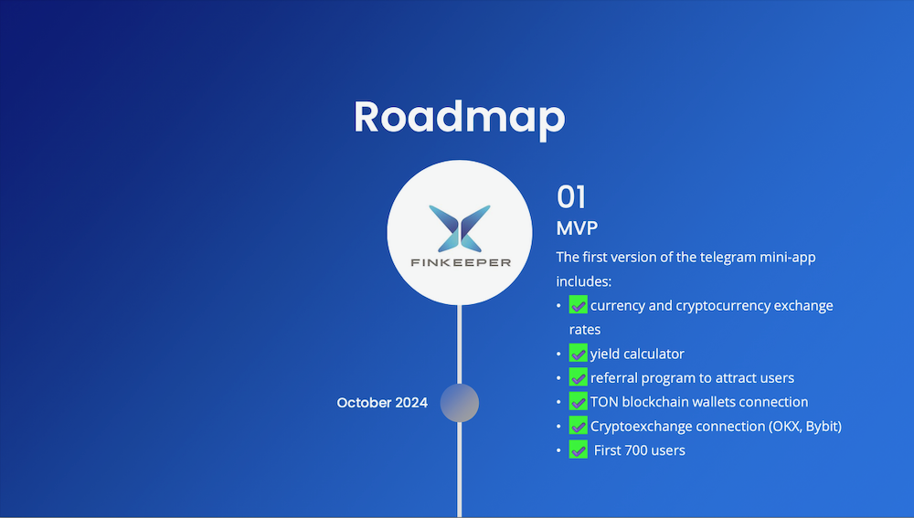
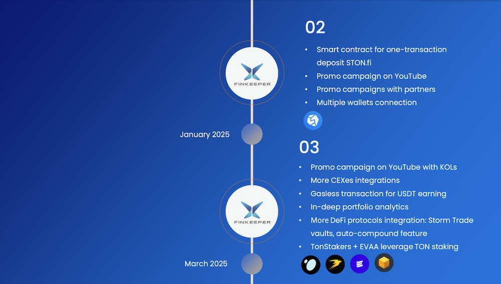
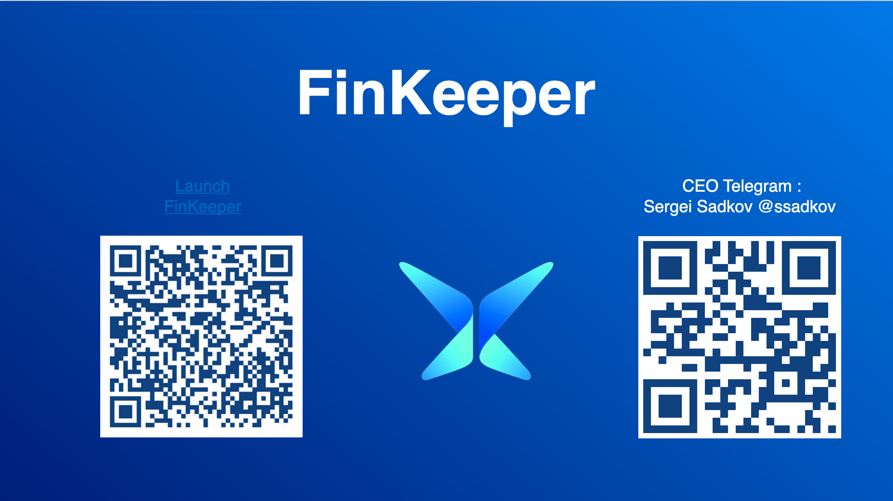

# Finkeeper

[FinKeeper](https://t.me/finkeeper_app_bot) — портфолио трекер внутри телеграм с умными подсказками и функцией yield farming.

Он позволяет:

1. увидеть полную картину своих криптофинансов с разных блокчейнов, сетей, кошельков и бирж на одном экране;
2. получать расчет % роста каждого актива;
3. прямо внутри портфолио выбирать выгодные предложения по стейкингу, фармингу;
4. выбирать самые выгодные предложения и в один клик отправлять свои активы в протоколы для получения прибыли, без необходимости разбираться в работе DeFi-инструментов.

FinKeeper реализован в виде мини-приложения Telegram.

Активы пользователей находятся в полной безопасности, поскольку все данные передаются через официальные API в режиме чтения.

**Подробнее о функциях FinKeeper.**

1. [Подключение аккаунтов бирж](integration/exchange.md)
2. [Подключение кошельков](integration/wallet.md)
3. [Калькулятор для конвертации криптовалют и фиата ](funkcii-rascheta/cal.md)(доллары, евро, рубли, тенге и другие валюты)
4. [APR-калькулятор](funkcii-rascheta/apr.md) для быстрого расчета прибыли протокола
5. [Yield Farming](#user-content-fn-1)[^1]
6. [P\&L](funkcii-rascheta/p-and-l.md) (расчет роста/просадки ваших активов)

<figure><figcaption></figcaption></figure>

<figure><figcaption></figcaption></figure>

<figure><figcaption></figcaption></figure>

### Перейти к разделам&#x20;

<table data-view="cards"><thead><tr><th></th><th></th><th data-hidden data-card-cover data-type="files"></th><th data-hidden></th><th data-hidden data-card-target data-type="content-ref"></th></tr></thead><tbody><tr><td><strong>Контакты</strong></td><td>
<a href="https://t.me/finkeeper_app_bot">Приложение FinKeeper</a>

<a href="https://t.me/finkeeper_ru">Телеграм-канал RU</a>

<a href="https://t.me/finkeeper_en">Telegram EN</a>

<a href="https://x.com/FinKeeper/">X (Twitter)</a>

<a href="https://app.gitbook.com/u/u3kXNQ1VPYWSSRvGGbFQ5HlWpKR2">Электронная почта</a>
</td><td></td><td></td><td><a href="home/kontakty.md">kontakty.md</a></td></tr><tr><td><strong>Интеграции</strong></td><td>Инструкции для добавления кошельков и бирж</td><td></td><td></td><td><a href="broken-reference">Broken link</a></td></tr><tr><td><strong>Функции расчета</strong></td><td>Описаний функций расчета p&#x26;l, калькулятора криптовалют и фиата, расчета APR и др.</td><td></td><td></td><td><a href="funkcii-rascheta/cal.md">cal.md</a></td></tr></tbody></table>

[^1]: Скоро!
