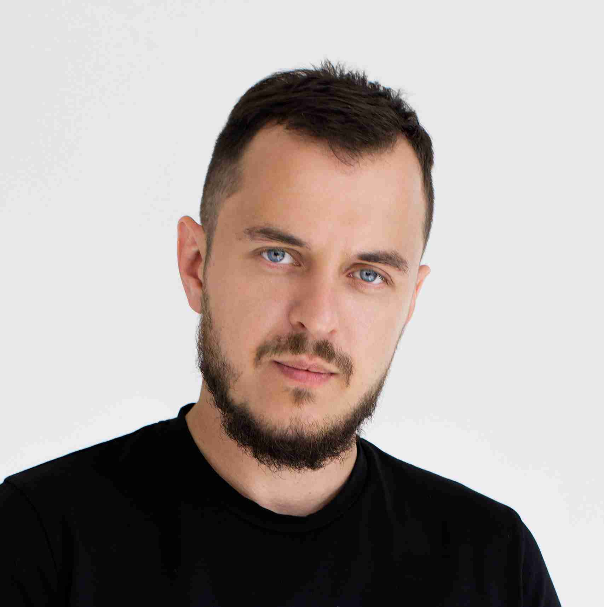
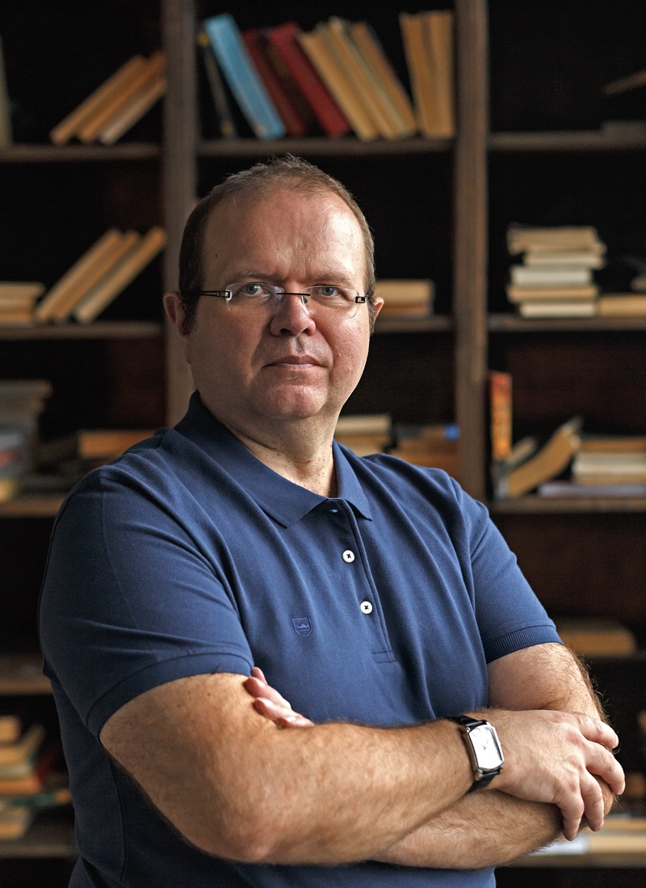
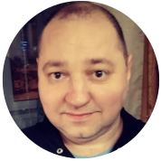
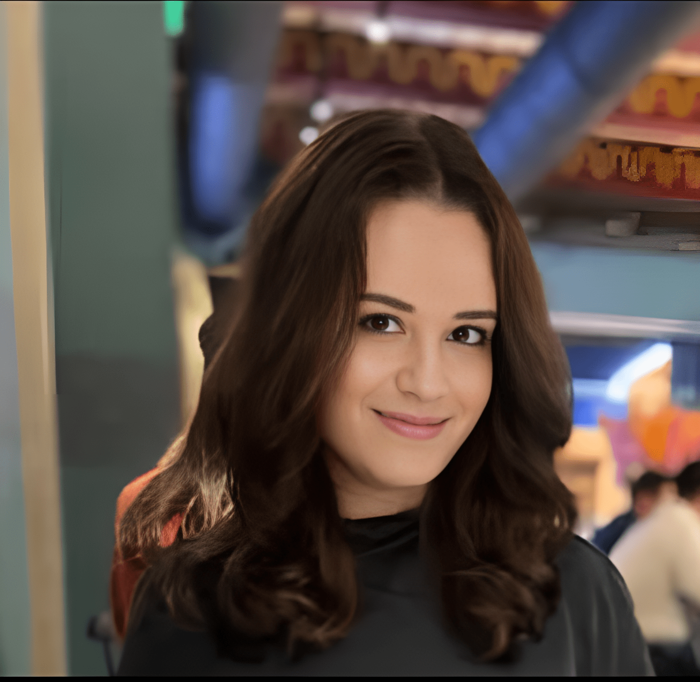
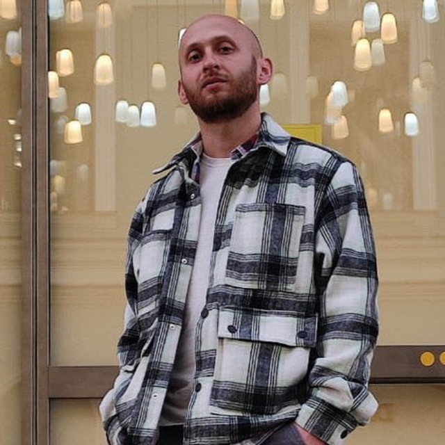

# Команда проекта

[Сергей Садков](team.md#sergei-sadkov). Сооснователь, директор проекта / Астана

[Константин Шереметьев](team.md#konstantin-sheremetev). Сооснователь, к.т.н. по программированию / Москва

[Андрей Анисков](team.md#andrei-aniskov). Ведущий программист / Москва

[Yasmeen Najmanova](team.md#yasmeen-najmanova). UI/UX-designer / Стамбул

[Анна Каринская](team.md#anna-karinskaya). Переводчик, комьюнити-менеджер / Вена

[Александр Рыбаков](team.md#aleksandr-rybakov). Директор по маркетингу / Москва

### Сергей Садков

<figure><figcaption>
Сергей Садков
</figcaption></figure>

Сергей Садков — сооснователь, директор проекта, архитектор приложения, криптоинвестор, специалист по DeFi, автор youtube-канала по DeFi (30 000 подписчиков).

Образование: инженер (Автоматизация и управление).

Предыдущие проекты:

* платформа для онлайн-школ «АвтоОфис» autooffice24.ru (сооснователь, директор, разработчик)
* платформа для выдачи образовательных сертификатов на блокчейне CTFN.pro (основатель)

Контакты:

* [Телеграм](https://t.me/cbdc_expert)
* [Youtube](https://www.youtube.com/@cbdc_expert)
* [X.com](https://x.com/ssadkov)

### Константин Шереметьев

<figure><figcaption>
Константин Шереметьев
</figcaption></figure>

Константин Шереметьев — сооснователь проекта, криптоинвестор.

Образование: к.т.н. (программирование), гранд доктор философии.

Предыдущие проекты:

* платформа для онлайн-школ «АвтоОфис» autooffice24.ru (сооснователь)
* онлайн-школа «Арнион» arnion.ru (сооснователь, автор)

Контакты:

* [Телеграм](https://t.me/sheremetev_crypto)
* [Youtube](https://www.youtube.com/@sheremetev_crypto)

### Андрей Анисков

<figure><figcaption>
Андрей Анисков
</figcaption></figure>

Андрей Анисков — ведущий программист.

Стек технологий: PHP, JavaScript, MySQL, Yii, Yii2, Laravel, TON Blockchain.

Предыдущие проекты:

* платформа для онлайн-школ «АвтоОфис» autooffice24.ru (ведущий программист)
* платформа для выдачи образовательных сертификатов на блокчейне CTFN.pro (ведущий программист)
* множественные интеграции с TON Blockchain, Zoom, плагины для Wordpress, расширения для Google Chrome

### Yasmeen Najmanova

<figure><figcaption>
Yasmeen Najmanova
</figcaption></figure>

Yasmeen Najmanova — UI/UX-designer.

Создает внешний вид FinKeeper, работает над функциональностью и удобством интерфейса приложения.

### Анна Каринская

<figure><figcaption>
Анна Каринская
</figcaption></figure>

Анна Каринская — переводчик, комьюнити-менеджер.

Владеет тремя языками: русский, английский, немецкий.

Переводит разделы приложения FinKeeper, документацию, контент, ведет соцсети проекта.

### Александр Рыбаков

<figure><figcaption>
Александр Рыбаков
</figcaption></figure>

Александр Рыбаков — директор по маркетингу.

Работает над продвижением FinKeeper.

* Более 15 лет опыта в области маркетинга и рекламы.
* Продюсировал Youtube-канал, который с нуля набрал более 350 тыс. подписчиков без вложений в рекламу.&#x20;
